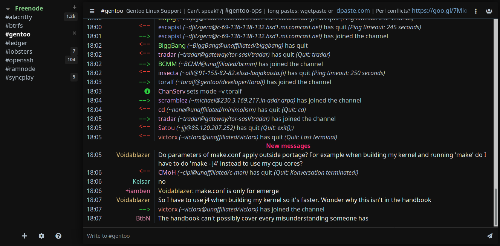

# Abyss

A theme for [The Lounge](https://github.com/thelounge/thelounge), a web IRC
client. Compatible with `v3.0.0-rc.4`.

To install, run `lounge install thelounge-theme-abyss` and restart The Lounge.
Abyss should now be available in your theme options.
